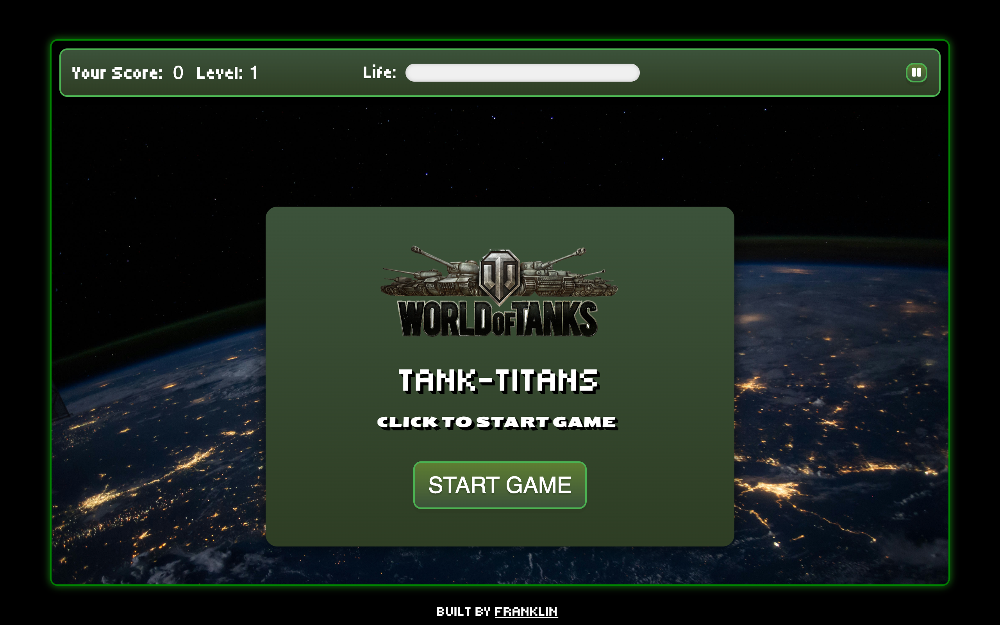

# Tank-titans Game

[Play the Game](https://uceecode.github.io/tank-titans/)

## Description

Tank Titans Game is an exciting and engaging browser-based game where players control a tank to defend against waves of incoming enemies. The goal is to survive as long as possible while racking up points by shooting enemies. As the game progresses, enemies become faster and more numerous, challenging players to improve their skills and strategy.

## Features

- **Dynamic Enemy Movement**: Enemies move towards the shooting tank from random positions on the screen borders.
- **Increasing Difficulty**: Enemy speed and spawn rate increase as the player's score increases.
- **Sound Effects**: Background music, shooting sounds, explosion sounds, and collision sounds for an immersive experience.
- **Score and Health Display**: Real-time updates of the player's score and tank's life.
- **Pause Button**: Pause button to pause and play the game.
- **Game Over Screen**: Display the final score and a game over message when the tank's life reaches zero.

## Technologies Used

- **HTML5**: Structure of the game and the audio elements.
- **CSS3**: Styling of the game elements including the shooting tank, enemies, and explosions.
- **JavaScript**: Core game logic, including enemy spawning, movement, collision detection, scoring, and sound effects.

## How to Play

1. **Start the Game**: Click the "Start" button to begin.
2. **Control the Shooting Tank**: Move your mouse to aim the shooting tank.
3. **Shoot**: Click the mouse to shoot at incoming enemies.
4. **Survive**: Prevent enemies from reaching and hitting the tank. Your life decreases with each hit.
5. **Score Points**: Shoot enemies to earn points. Try to beat your high score!.
6. **Pause**: Click on the space bar or pause icon to pause the game.

